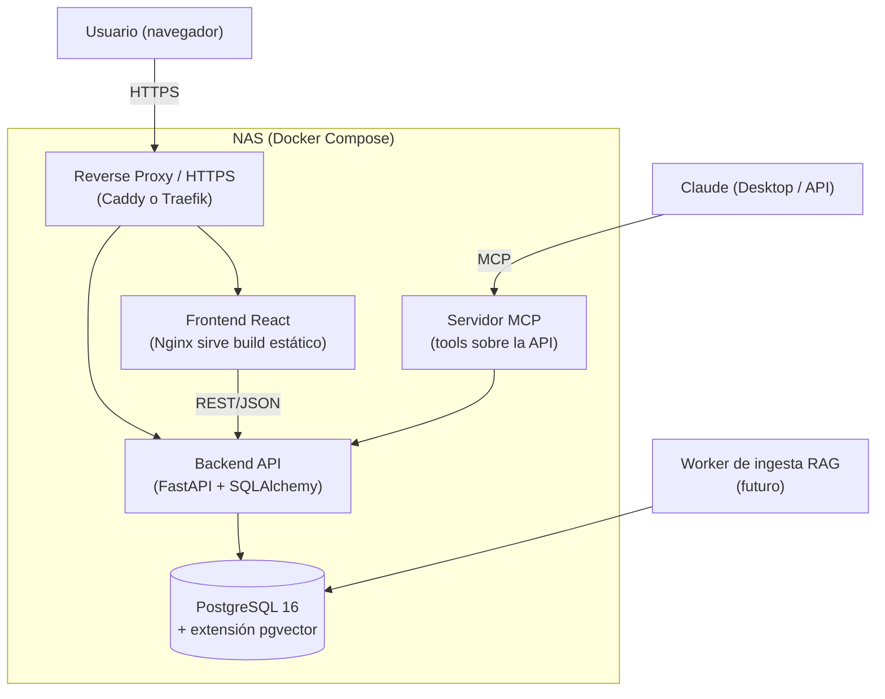
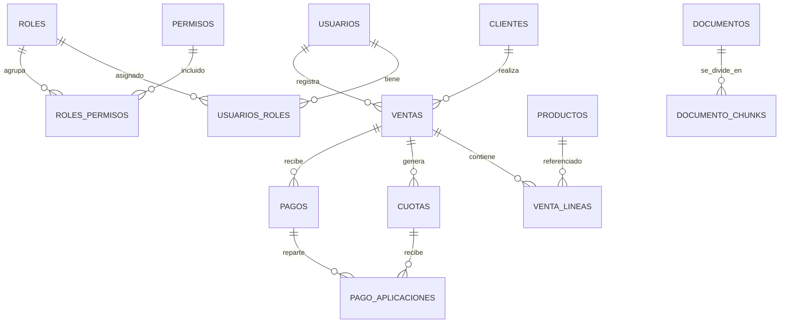

# SDD — Mini-ERP Comercial CNA (Web)

> **Software Design Document** · v0.1 (borrador para revisión)
> Proyecto: Sistema de gestión comercial para **venta de fertilizantes** (cliente CNA — Alex Niklitschek).
> Cambio de plataforma: de Excel `.xlsm` + VBA → **aplicación web** (PostgreSQL + React) alojada en NAS.
> Fecha: 12/06/2026 · Idioma: español latinoamericano · Moneda: CLP `$1.000.000,00` · Fechas DD/MM/YYYY.

---

## 1. Propósito y alcance

### 1.1 Propósito
Reemplazar la planilla manual (`FERTILIZANTES CNA 2025.xlsx`) por una aplicación web multiusuario que gestione el ciclo comercial completo de venta de fertilizantes: maestros, ventas con detalle, cobranza por cuotas con interés por mora y pagos en cascada.

### 1.2 Objetivos de diseño
- **Intuitiva y fácil de usar**, con una estética profesional y sobria.
- **Self-hosted en NAS** (Synology/QNAP u otro con Docker), sin dependencia de nube de terceros.
- **Control de usuarios** desde el día 1; **perfiles y multiusuario** como evolución natural (RBAC).
- **Preparada para RAG** futuro (búsqueda semántica sobre documentos y datos) → `pgvector`.
- **Exponible como MCP** para conectarse a Claude (consultas y operaciones asistidas por IA).

### 1.3 Fuera de alcance (por ahora)
- Facturación electrónica / integración SII.
- App móvil nativa (la web será responsive).
- Multi-tenant real (varias empresas aisladas). Se deja la puerta abierta en el modelo, pero el MVP es **single-tenant, multiusuario**.

---

## 2. Requisitos

### 2.1 Funcionales (RF)
| ID | Requisito |
|---|---|
| RF-01 | Alta/edición/baja lógica de **clientes** (razón social, RUT, contacto). |
| RF-02 | Alta/edición/baja lógica de **productos** (fertilizantes: nombre, formulación, unidad, costo, precio). |
| RF-03 | Registro de **ventas con detalle de líneas**; cálculo de Neto + IVA 19% + Total. |
| RF-04 | Generación automática de **cuotas mensuales** al confirmar una venta. |
| RF-05 | Cálculo de **interés por mora** (1% mensual sobre saldo de cuota vencida; 1 día = 1 mes). |
| RF-06 | Registro de **pagos** y aplicación **en cascada** (de la cuota más antigua a la más nueva). |
| RF-07 | **Prórroga** de cuotas (nueva fecha de vencimiento, con o sin recálculo de mora). |
| RF-08 | Consultas: estado de cuenta por cliente, cuotas vencidas, ventas por período. |
| RF-09 | **Tablero** con KPIs (margen acumulado, CxC vigente, mora). |
| RF-10 | **Autenticación** y gestión de usuarios; roles/permisos (RBAC). |
| RF-11 | **Auditoría**: quién creó/modificó cada registro y cuándo. |

### 2.2 No funcionales (RNF)
- **RNF-01 Seguridad:** contraseñas con hash (argon2/bcrypt), tokens firmados, HTTPS, principio de mínimo privilegio.
- **RNF-02 Integridad:** transacciones atómicas (una venta y sus cuotas se guardan todo-o-nada).
- **RNF-03 Portabilidad:** todo en contenedores Docker; despliegue reproducible en NAS.
- **RNF-04 Mantenibilidad:** migraciones versionadas de BD; código tipado (TypeScript / type hints).
- **RNF-05 Usabilidad:** flujos de ≤3 clics para tareas frecuentes; validación en formulario en tiempo real.
- **RNF-06 Respaldo:** dumps automáticos de PostgreSQL programados en el NAS.
- **RNF-07 Localización:** CLP, DD/MM/YYYY, separador de miles `.` y decimal `,`.

---

## 3. Arquitectura

### 3.1 Vista de alto nivel



### 3.2 Stack propuesto
| Capa | Tecnología | Por qué |
|---|---|---|
| **Frontend** | React + **TypeScript** + **Vite** | Requisito del cliente; Vite = build rápido y simple. |
| UI / diseño | **shadcn/ui + Tailwind CSS** (alt: Mantine) | Look profesional, accesible y personalizable sin pelear con CSS. |
| Estado/datos | **TanStack Query** + React Router | Caché de servidor, sincronización, navegación. |
| **Backend** | **Python + FastAPI** | Excelente para REST, validación (Pydantic) y, sobre todo, **afinidad con RAG/IA y MCP**. |
| ORM / migraciones | **SQLAlchemy 2 + Alembic** | Modelo tipado y migraciones versionadas. |
| **Base de datos** | **PostgreSQL 16** + `pgvector` | Robusta, transaccional, y `pgvector` habilita el RAG sin otra BD. |
| Auth | JWT (access + refresh) o cookie de sesión + RBAC | Control de usuarios desde el MVP. |
| **MCP** | SDK MCP (Python) exponiendo *tools* sobre la API | Conexión directa con Claude. |
| Empaquetado | **Docker Compose** | Despliegue reproducible en el NAS. |

> **Nota de decisión:** el front es React por requisito. El backend lo propongo en **Python/FastAPI** porque RAG (embeddings) y el MCP viven cómodos en ese ecosistema. Si prefieres un *monorepo* todo-TypeScript (backend en NestJS/Fastify), es viable —lo dejo como decisión abierta en §11.

---

## 4. Modelo de datos

### 4.1 Diagrama entidad-relación (dominio + seguridad)



### 4.2 DDL — Núcleo del dominio
> PostgreSQL 16. PKs `bigint` identity; montos `numeric(14,2)`; baja lógica con `activo`/`anulada`. Auditoría con `creado_por`, `creado_en`, `actualizado_en`.

```sql
-- Extensiones
CREATE EXTENSION IF NOT EXISTS pgcrypto;   -- gen_random_uuid()
CREATE EXTENSION IF NOT EXISTS vector;     -- RAG (pgvector)

-- ========== MAESTROS ==========
CREATE TABLE clientes (
    id              bigint GENERATED ALWAYS AS IDENTITY PRIMARY KEY,
    razon_social    text        NOT NULL,
    rut             text        NOT NULL UNIQUE,           -- formato 12.345.678-9
    giro            text,
    email           text,
    telefono        text,
    direccion       text,
    activo          boolean     NOT NULL DEFAULT true,
    creado_por      bigint      REFERENCES usuarios(id),
    creado_en       timestamptz NOT NULL DEFAULT now(),
    actualizado_en  timestamptz NOT NULL DEFAULT now()
);

CREATE TABLE productos (
    id              bigint GENERATED ALWAYS AS IDENTITY PRIMARY KEY,
    nombre          text        NOT NULL,
    formulacion     text,                                  -- p.ej. "8-25-15-0,1B"
    unidad          text        NOT NULL DEFAULT 'KG',     -- KG / LTS / TON
    costo_unitario  numeric(14,2) NOT NULL DEFAULT 0,
    precio_unitario numeric(14,2) NOT NULL DEFAULT 0,
    activo          boolean     NOT NULL DEFAULT true,
    creado_en       timestamptz NOT NULL DEFAULT now(),
    actualizado_en  timestamptz NOT NULL DEFAULT now()
);

-- ========== VENTAS ==========
CREATE TABLE ventas (
    id              bigint GENERATED ALWAYS AS IDENTITY PRIMARY KEY,
    folio           text        UNIQUE,                    -- folio comercial (humano)
    cliente_id      bigint      NOT NULL REFERENCES clientes(id),
    fecha_emision   date        NOT NULL DEFAULT current_date,
    plazo_dias      int         NOT NULL DEFAULT 0,        -- plazo sin interés
    n_cuotas        int         NOT NULL DEFAULT 1 CHECK (n_cuotas >= 1),
    base_cobranza   text        NOT NULL DEFAULT 'TOTAL'   -- 'NETO' | 'TOTAL' (ver §5.1)
                                CHECK (base_cobranza IN ('NETO','TOTAL')),
    neto            numeric(14,2) NOT NULL DEFAULT 0,      -- calculado de líneas
    iva             numeric(14,2) NOT NULL DEFAULT 0,      -- 19%
    total           numeric(14,2) NOT NULL DEFAULT 0,      -- neto + iva
    estado          text        NOT NULL DEFAULT 'VIGENTE' -- VIGENTE | PAGADA | ANULADA
                                CHECK (estado IN ('VIGENTE','PAGADA','ANULADA')),
    creado_por      bigint      REFERENCES usuarios(id),
    creado_en       timestamptz NOT NULL DEFAULT now(),
    actualizado_en  timestamptz NOT NULL DEFAULT now()
);

CREATE TABLE venta_lineas (
    id              bigint GENERATED ALWAYS AS IDENTITY PRIMARY KEY,
    venta_id        bigint      NOT NULL REFERENCES ventas(id) ON DELETE CASCADE,
    producto_id     bigint      NOT NULL REFERENCES productos(id),
    cantidad        numeric(14,3) NOT NULL CHECK (cantidad > 0),
    precio_unitario numeric(14,2) NOT NULL,                -- congela el precio al momento de la venta
    costo_unitario  numeric(14,2) NOT NULL DEFAULT 0,      -- congela costo (para margen)
    subtotal        numeric(14,2) GENERATED ALWAYS AS (cantidad * precio_unitario) STORED
);

-- ========== COBRANZA POR CUOTAS ==========
CREATE TABLE cuotas (
    id              bigint GENERATED ALWAYS AS IDENTITY PRIMARY KEY,
    venta_id        bigint      NOT NULL REFERENCES ventas(id) ON DELETE CASCADE,
    numero          int         NOT NULL,                  -- 1..n
    monto           numeric(14,2) NOT NULL,                -- capital de la cuota
    fecha_vencimiento date      NOT NULL,
    fecha_prorroga  date,                                  -- vencimiento extendido (opcional)
    estado          text        NOT NULL DEFAULT 'PENDIENTE'
                                CHECK (estado IN ('PENDIENTE','PARCIAL','PAGADA','ANULADA')),
    UNIQUE (venta_id, numero)
);

-- ========== PAGOS (en cascada) ==========
CREATE TABLE pagos (
    id              bigint GENERATED ALWAYS AS IDENTITY PRIMARY KEY,
    venta_id        bigint      NOT NULL REFERENCES ventas(id),
    fecha           date        NOT NULL DEFAULT current_date,
    monto           numeric(14,2) NOT NULL CHECK (monto > 0),
    medio           text,                                  -- transferencia, efectivo, encomienda...
    glosa           text,
    creado_por      bigint      REFERENCES usuarios(id),
    creado_en       timestamptz NOT NULL DEFAULT now()
);

-- Reparto de cada pago sobre las cuotas (capital + interés mora)
CREATE TABLE pago_aplicaciones (
    id              bigint GENERATED ALWAYS AS IDENTITY PRIMARY KEY,
    pago_id         bigint      NOT NULL REFERENCES pagos(id) ON DELETE CASCADE,
    cuota_id        bigint      NOT NULL REFERENCES cuotas(id),
    monto_capital   numeric(14,2) NOT NULL DEFAULT 0,
    monto_interes   numeric(14,2) NOT NULL DEFAULT 0
);

-- ========== PARÁMETROS ==========
CREATE TABLE parametros (
    clave           text PRIMARY KEY,
    valor           text NOT NULL,
    descripcion     text
);
INSERT INTO parametros (clave, valor, descripcion) VALUES
    ('IVA_PCT',          '0.19', 'Tasa de IVA'),
    ('MORA_PCT_MENSUAL', '0.01', 'Interés por mora mensual sobre saldo vencido'),
    ('DIAS_POR_MES',     '30',   'Días por mes para el cálculo de mora'),
    ('BASE_COBRANZA',    'TOTAL','Base de cuotas por defecto: NETO o TOTAL');
```

### 4.3 DDL — Seguridad y usuarios (RBAC)

```sql
CREATE TABLE usuarios (
    id              bigint GENERATED ALWAYS AS IDENTITY PRIMARY KEY,
    email           text        NOT NULL UNIQUE,
    nombre          text        NOT NULL,
    password_hash   text        NOT NULL,                  -- argon2/bcrypt
    activo          boolean     NOT NULL DEFAULT true,
    ultimo_acceso   timestamptz,
    creado_en       timestamptz NOT NULL DEFAULT now()
);

CREATE TABLE roles (
    id              bigint GENERATED ALWAYS AS IDENTITY PRIMARY KEY,
    nombre          text NOT NULL UNIQUE,                  -- admin, vendedor, cobranza, lectura
    descripcion     text
);

CREATE TABLE permisos (
    id              bigint GENERATED ALWAYS AS IDENTITY PRIMARY KEY,
    clave           text NOT NULL UNIQUE                   -- p.ej. ventas.crear, clientes.editar
);

CREATE TABLE usuarios_roles (
    usuario_id      bigint NOT NULL REFERENCES usuarios(id) ON DELETE CASCADE,
    rol_id          bigint NOT NULL REFERENCES roles(id)    ON DELETE CASCADE,
    PRIMARY KEY (usuario_id, rol_id)
);

CREATE TABLE roles_permisos (
    rol_id          bigint NOT NULL REFERENCES roles(id)     ON DELETE CASCADE,
    permiso_id      bigint NOT NULL REFERENCES permisos(id)  ON DELETE CASCADE,
    PRIMARY KEY (rol_id, permiso_id)
);

-- Auditoría genérica (append-only)
CREATE TABLE auditoria (
    id              bigint GENERATED ALWAYS AS IDENTITY PRIMARY KEY,
    usuario_id      bigint REFERENCES usuarios(id),
    entidad         text   NOT NULL,                        -- 'venta', 'cliente'...
    entidad_id      bigint,
    accion          text   NOT NULL,                        -- crear/editar/anular
    detalle         jsonb,
    creado_en       timestamptz NOT NULL DEFAULT now()
);
```

### 4.4 DDL — Estructura para RAG (futuro, ya disponible)

```sql
-- Documentos fuente para búsqueda semántica (facturas, fichas técnicas, contratos, etc.)
CREATE TABLE documentos (
    id              bigint GENERATED ALWAYS AS IDENTITY PRIMARY KEY,
    tipo            text NOT NULL,                          -- factura, ficha_producto, contrato...
    titulo          text NOT NULL,
    origen          text,                                   -- ruta/URL/referencia
    entidad_rel     text,                                   -- tabla relacionada (opcional)
    entidad_rel_id  bigint,                                 -- id relacionado (opcional)
    metadata        jsonb,
    creado_en       timestamptz NOT NULL DEFAULT now()
);

-- Fragmentos vectorizados. Dimensión 1536 = ejemplo (ajustar al modelo de embeddings elegido).
CREATE TABLE documento_chunks (
    id              bigint GENERATED ALWAYS AS IDENTITY PRIMARY KEY,
    documento_id    bigint NOT NULL REFERENCES documentos(id) ON DELETE CASCADE,
    contenido       text   NOT NULL,
    embedding       vector(1536),
    chunk_idx       int    NOT NULL,
    metadata        jsonb
);
-- Índice ANN para búsqueda por similitud coseno
CREATE INDEX idx_chunks_embedding ON documento_chunks
    USING hnsw (embedding vector_cosine_ops);
```

---

## 5. Reglas de negocio (cálculos)

### 5.1 Venta
- `subtotal_linea = cantidad × precio_unitario`
- `neto = Σ subtotal_linea`
- `iva = round(neto × IVA_PCT)`  (IVA_PCT = 0,19)
- `total = neto + iva`
- `margen = Σ (cantidad × (precio_unitario − costo_unitario))`

> **⚠️ Decisión pendiente (ver §11):** la base de las cuotas. CLAUDE.md indica **Total con IVA**; README V3.0 indica **Neto** (IVA informativo). El modelo soporta ambas vía `ventas.base_cobranza` / parámetro `BASE_COBRANZA`. **Hay que confirmar cuál es la correcta.**

### 5.2 Generación de cuotas
- Sea `B` = base de cobranza (`neto` o `total` según §5.1) y `n = n_cuotas`.
- `monto_cuota = floor(B / n)` para las cuotas 1..n-1; la **última cuota absorbe el redondeo**: `monto_cuota_n = B − (n−1) × floor(B/n)`.
- `fecha_vencimiento[i] = fecha_base + (i) meses` (fecha base = emisión + plazo, según política a confirmar).

### 5.3 Interés por mora (solo mora)
Para una cuota vencida e impaga, evaluada a la fecha `hoy`:
- `venc = COALESCE(fecha_prorroga, fecha_vencimiento)`
- `dias_atraso = hoy − venc`
- Si `dias_atraso ≤ 0` → interés = 0.
- Si `dias_atraso ≥ 1` → `meses_mora = ceil(dias_atraso / DIAS_POR_MES)` (**1 día = 1 mes = 1%**).
- `interes_mora = saldo_capital_cuota × MORA_PCT_MENSUAL × meses_mora`

### 5.4 Pagos en cascada
- Un pago de monto `M` por una venta se reparte **de la cuota más antigua a la más nueva**.
- Por cada cuota se cubre primero **interés de mora**, luego **capital** (orden a confirmar — alternativa: capital primero).
- Cada aplicación se registra en `pago_aplicaciones`; al cubrir el saldo, la cuota pasa a `PAGADA`; si la venta queda sin saldo, pasa a `PAGADA`.
- Toda la operación (pago + aplicaciones + cambios de estado) ocurre en **una transacción**.

---

## 6. API (REST/JSON) — esbozo

| Método | Ruta | Descripción | Permiso |
|---|---|---|---|
| POST | `/auth/login` | Login, devuelve tokens | — |
| POST | `/auth/refresh` | Renueva access token | — |
| GET/POST | `/clientes` | Listar / crear | `clientes.*` |
| GET/PUT/DELETE | `/clientes/{id}` | Detalle / editar / baja lógica | `clientes.*` |
| GET/POST | `/productos` | Listar / crear | `productos.*` |
| GET/POST | `/ventas` | Listar / crear (con líneas; genera cuotas) | `ventas.*` |
| GET | `/ventas/{id}` | Detalle con líneas y cuotas | `ventas.ver` |
| POST | `/ventas/{id}/anular` | Anula venta (reversa cuotas/pagos) | `ventas.anular` |
| POST | `/pagos` | Registrar pago (reparto en cascada) | `pagos.crear` |
| POST | `/cuotas/{id}/prorroga` | Prorrogar cuota | `cobranza.prorroga` |
| GET | `/clientes/{id}/estado-cuenta` | Cuotas, saldos, mora | `cobranza.ver` |
| GET | `/tablero` | KPIs (margen, CxC, mora) | `tablero.ver` |
| GET | `/usuarios`, `/roles` | Administración | `admin` |

---

## 7. Frontend (React)

### 7.1 Estructura de páginas
- **Login** → control de acceso.
- **Tablero** → tarjetas KPI (margen acumulado, CxC vigente, cuotas vencidas, top deudores) + gráficos.
- **Clientes** → tabla con buscador + ficha (estado de cuenta integrado).
- **Productos** → catálogo editable.
- **Nueva venta** → formulario cabecera + grilla de líneas (cálculo de Neto/IVA/Total en vivo), vista previa de cuotas antes de confirmar.
- **Cobranza** → cuotas vencidas, registrar pago, prórrogas.
- **Administración** → usuarios, roles, parámetros (solo `admin`).

### 7.2 Lineamientos UX/UI
- Layout con barra lateral + topbar; **shadcn/ui + Tailwind** para componentes consistentes.
- Tablas con búsqueda, orden y paginación (TanStack Table).
- Validación en vivo (RUT chileno, montos CLP con formato `$1.000.000,00`).
- Estados de carga/skeletons; mensajes de éxito/error visibles (heredado de la regla "mensajería siempre visible" V2.1).
- Modo claro/oscuro; tipografía y paleta sobrias (toque profesional).

### 7.3 Organización de carpetas (sugerida)
```
frontend/
  src/
    pages/        # Tablero, Clientes, Ventas, Cobranza, Admin
    components/   # UI reutilizable
    features/     # lógica por dominio (clientes, ventas, cobranza)
    lib/          # api client, formatos CLP/fecha, auth
    hooks/
    routes.tsx
```

---

## 8. Seguridad y control de usuarios
- Contraseñas con **argon2id**; nunca en texto plano.
- **JWT** access (corto) + refresh (rotación), o cookies `HttpOnly` de sesión.
- **RBAC**: permisos granulares por clave (`ventas.crear`, etc.) agrupados en roles.
  - Roles iniciales: `admin`, `vendedor`, `cobranza`, `lectura`.
- Middleware de autorización por endpoint; el front oculta acciones sin permiso (defensa en profundidad, pero la fuente de verdad es el backend).
- **Auditoría** de operaciones sensibles (ventas, pagos, anulaciones).
- HTTPS obligatorio vía reverse proxy en el NAS.

---

## 9. RAG (diseño preparado, implementación futura)
- **Almacenamiento:** `documentos` + `documento_chunks` con `vector` (pgvector) — ya en el modelo (§4.4).
- **Ingesta (worker futuro):** extraer texto → trocear (chunking) → generar embeddings → guardar en `documento_chunks`.
- **Consulta:** búsqueda por similitud coseno (índice HNSW) + filtros por `metadata`/entidad.
- **Casos de uso:** "buscar la ficha técnica del producto X", "resumir historial de un cliente", preguntas en lenguaje natural sobre ventas/cobranza.
- **Embeddings:** elegir modelo y fijar dimensión del `vector(N)` (1536 es placeholder).

---

## 10. MCP (conexión con Claude — futuro)
- Servicio MCP independiente que expone **tools** sobre la misma API/DB. Ejemplos:
  - `consultar_estado_cuenta(cliente)` · `cuotas_vencidas(periodo)` · `resumen_ventas(periodo)` · `buscar_producto(texto)` (RAG).
  - Operaciones de escritura (registrar pago, crear cliente) **con confirmación explícita** y bajo permisos.
- Autenticación del MCP con **API key / token de servicio** mapeado a un usuario con rol acotado.
- Permite que desde **Claude (Desktop o API)** se consulte y opere el ERP en lenguaje natural, reutilizando RBAC y auditoría.

---

## 11. Decisiones pendientes y riesgos
| # | Tema | Opciones | Recomendación |
|---|---|---|---|
| D-1 | **Base de cuotas** | Neto (README) vs Total con IVA (CLAUDE.md) | **Confirmar con el negocio.** Modelo ya soporta ambas. |
| D-2 | **Backend** | FastAPI (Python) vs NestJS (TS, monorepo) | FastAPI por afinidad RAG/MCP; decidir según tu comodidad. |
| D-3 | Orden de aplicación en pago | Interés→capital vs Capital→interés | Confirmar política de cobranza. |
| D-4 | Fecha base de cuotas | Emisión vs (Emisión + plazo) | Confirmar. |
| D-5 | Migración de datos | ¿Importar el `.xlsx` histórico 2025/2026? | Recomendado: script de carga inicial. |
| D-6 | NAS / Docker | ¿Modelo de NAS y soporte Docker? | Verificar Container Manager y recursos. |
| R-1 | Riesgo: errores en datos heredados (RUT duplicado, fechas inválidas) | — | Validar/limpiar antes de migrar. |

---

## 12. Roadmap por fases
1. **Fase 0 — Cimientos:** Docker Compose (Postgres+pgvector, API, front, proxy) en el NAS; auth básica; migraciones.
2. **Fase 1 — MVP comercial:** clientes, productos, ventas con líneas, cuotas, pagos en cascada, estado de cuenta, tablero. Migración del histórico.
3. **Fase 2 — Multiusuario/perfiles:** RBAC completo, auditoría, administración de usuarios.
4. **Fase 3 — RAG:** worker de ingesta + búsqueda semántica.
5. **Fase 4 — MCP:** tools de consulta y operación conectables a Claude.

---

> **Siguiente paso sugerido:** confirmar D-1 y D-2; con eso puedo (a) afinar el DDL definitivo, (b) generar el `docker-compose.yml` para el NAS, y (c) andamiar el repo (backend + frontend) para empezar la Fase 0.
